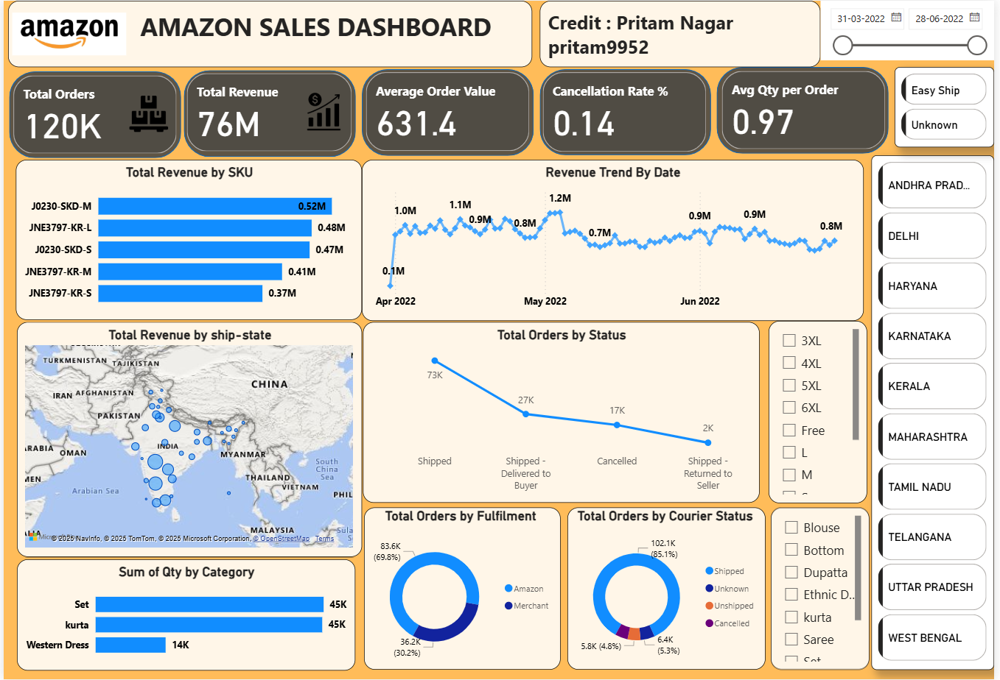

# Amazon Sales Dashboard - Power BI

## Project Overview
This project presents an interactive Power BI dashboard built on Amazon sales data.
It provides a view of orders, revenue, fulfilment, and product performance.

## Key Features
- KPIs: Total Orders, Total Revenue, Average Order Value, Cancellation Rate, Average Quantity per Order
- Trend analysis: Revenue over time with date slicer
- Top products: SKU-wise performance tracking
- Geographic view: Sales by state displayed on a map
- Category and fulfilment insights: Category quantity, fulfilment channel, courier status
- Interactive filters: State, Size, Category, Date range, Fulfilment
- Clean layout: Logo and consistent theme

## Files in This Folder
- `amazon_sales_dashboard.pbix`
- `amazon_theme_file.json`
- `dashboard_img.png`
- `logo.jpeg`
- `mzazon_logo.jpg`

## Tools Used
- Power BI Desktop
- Power Query
- DAX measures
